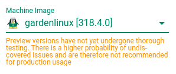

# Preparing Garden Linux for eBPF

Create a Gardener shoot cluster with Garden Linux 318.4.0 (preview).
The default version will not work.



Install kernel headers on the nodes.

Edit `garden-linux-kernel-headers-install.yaml` and do the following changes:
* Update the IP of the Garden Linux package repository
* Uncomment the `command:` line

Then, apply the changes:
```
$ kubectl apply -f garden-linux-kernel-headers-install.yaml
```

Ensure the installation completes successfully:

```
$ kubectl logs -f kernel-headers-install-tc9ft
......
Setting up linux-compiler-gcc-10-x86 (5.4.93-1) ...
Setting up linux-kbuild-5.4 (5.4.93-1) ...
Setting up linux-headers-5.4.0-6-common (5.4.93-1) ...
Setting up linux-headers-5.4.0-6-cloud-amd64 (5.4.93-1) ...
Done.
+ echo Done.
Done.
+ echo Done.
+ sleep infinity
```
